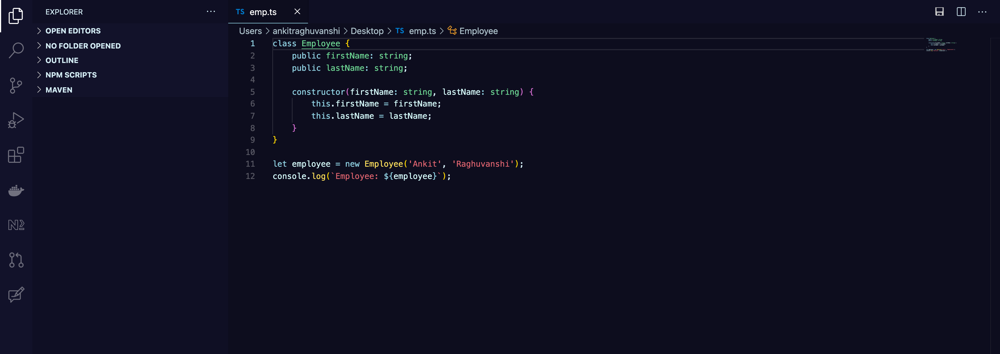

# Rabobank VSCode Theme

This extension for Visual Studio Code adds themes titled "Rabobank". This is based on the Rabobank style color codes.

I personally use the dark themes for most occasions, soon there will be a lighter version available.

## Installation
As the Rabobank theme plugin is yet not available on marketplace, you can still install
1. Install from VSIX...
2. Select the `vsix` file.
3. Click Reload to reload your editor
4. Enjoy!
